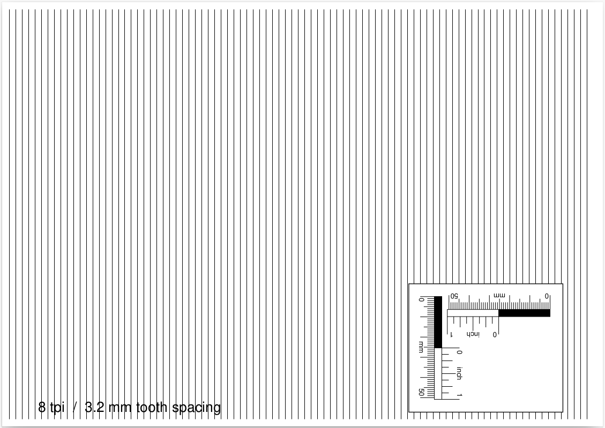

Saw Filing Guides
==============================================================================

Simple guides for filing the teeth of western hand saws.

The sheets will be filled with horizontal lines. Distance between lines
corresponds to the spacing of saw teeth or the gullets in between. Works best
with rip cut saws.



A [pdf-file](saw_filing_guide.pdf) for printing (A4 format, 18 pages): 
A single page with a custom tpi (teeth per inch) value (currently 2.3 tpi/11.0 mm tooth spacing) is followed by pages with values from 4 tpi through 20 tpi.

The pages must be printed WITHOUT further scaling by the printer.

This page was generated from a [PostScript file](saw_filing_guide.ps). Not every PostScript printer might print all pages as they are created programatically in a loop in the PostScript. Therefore, it may be useful to print from the pdf-file.

Page size and the custom tpi value can be adjusted in the configuration section at the beginning of the PostScript file. If you have GhostScript installed you can create the pdf-file with:

```bash
ps2pdf saw_filing_guide.ps
```

These guides can also be used in combination with [this](https://paulsellers.com/2012/11/recutting-saw-teeth-an-at-the-bench-method-that-works/) and [this](https://paulsellers.com/2014/05/teething-troubles-retoothing-your-tenon-saw/) method by Paul Sellers for recutting saw teeth/retoothing a saw or building a new one.

